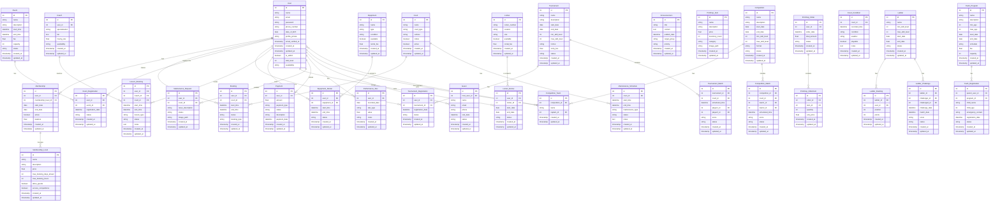

## ERD

```mermaid
erDiagram
    User ||--o{ Membership : "has"
    User ||--o{ Booking : "makes"
    User ||--o{ Event_Registration : "registers for"
    User ||--o{ Tournament_Registration : "participates in"
    User ||--o{ Lesson_Booking : "books"
    User ||--o{ Equipment_Rental : "rents"
    User ||--o{ Locker_Rental : "rents"
    User ||--o{ Maintenance_Request : "submits"
    User ||--o{ Payment : "makes"
    User ||--o{ Performance_Stat : "has"
    User ||--o{ Guest : "brings"
    User ||--o{ Competition_Team : "joins"
    User {
        int id PK
        string name
        string email
        string password
        string phone_number
        date date_of_birth
        string profile_picture
        timestamp email_verified_at
        timestamp created_at
        timestamp updated_at
        boolean is_admin
        int skill_level
        string availability
    }
    
    Membership {
        int id PK
        int user_id FK
        int membership_level_id FK
        date start_date
        date end_date
        boolean active
        float balance
        timestamp created_at
        timestamp updated_at
    }
    
    Membership_Level {
        int id PK
        string name
        string description
        float price
        int max_booking_days_ahead
        int max_booking_hours
        boolean allow_guests
        boolean access_competitions
        timestamp created_at
        timestamp updated_at
    }
    
    Membership ||--o{ Membership_Level : "has type"
    
    Court {
        int id PK
        string name
        string court_type
        string surface
        boolean indoor
        boolean active
        timestamp created_at
        timestamp updated_at
    }
    
    Court ||--o{ Booking : "is booked for"
    Court ||--o{ Maintenance_Schedule : "has"
    
    Booking {
        int id PK
        int user_id FK
        int court_id FK
        datetime start_time
        datetime end_time
        string status
        string booking_type
        timestamp created_at
        timestamp updated_at
    }
    
    Tournament {
        int id PK
        string name
        string description
        date start_date
        date end_date
        int min_skill_level
        int max_skill_level
        string format
        float entry_fee
        string status
        timestamp created_at
        timestamp updated_at
    }
    
    Tournament ||--o{ Tournament_Registration : "has"
    Tournament ||--o{ Tournament_Match : "contains"
    
    Tournament_Registration {
        int id PK
        int user_id FK
        int tournament_id FK
        datetime registration_date
        string status
        timestamp created_at
        timestamp updated_at
    }
    
    Tournament_Match {
        int id PK
        int tournament_id FK
        int court_id FK
        datetime scheduled_time
        int player1_id FK
        int player2_id FK
        string score
        string status
        timestamp created_at
        timestamp updated_at
    }
    
    Coach {
        int id PK
        int user_id FK
        string specialization
        text bio
        float hourly_rate
        string availability
        timestamp created_at
        timestamp updated_at
    }
    
    Coach ||--o{ Lesson_Booking : "teaches"
    
    Lesson_Booking {
        int id PK
        int user_id FK
        int coach_id FK
        int court_id FK
        datetime start_time
        datetime end_time
        string lesson_type
        string status
        text notes
        timestamp created_at
        timestamp updated_at
    }
    
    Competition {
        int id PK
        string name
        string description
        date start_date
        date end_date
        int min_skill_level
        int max_skill_level
        string format
        string status
        timestamp created_at
        timestamp updated_at
    }
    
    Competition ||--o{ Competition_Team : "has"
    Competition ||--o{ Competition_Match : "includes"
    
    Competition_Team {
        int id PK
        int competition_id FK
        string name
        int captain_id FK
        timestamp created_at
        timestamp updated_at
    }
    
    Competition_Team ||--o{ User : "has members"
    
    Competition_Match {
        int id PK
        int competition_id FK
        int court_id FK
        int team1_id FK
        int team2_id FK
        datetime scheduled_time
        string score
        string status
        timestamp created_at
        timestamp updated_at
    }
    
    Payment {
        int id PK
        int user_id FK
        float amount
        string payment_type
        string status
        string description
        datetime payment_date
        timestamp created_at
        timestamp updated_at
    }
    
    Equipment {
        int id PK
        string name
        string type
        string condition
        boolean available
        float rental_fee
        timestamp created_at
        timestamp updated_at
    }
    
    Equipment ||--o{ Equipment_Rental : "is rented in"
    
    Equipment_Rental {
        int id PK
        int user_id FK
        int equipment_id FK
        datetime start_time
        datetime end_time
        string status
        timestamp created_at
        timestamp updated_at
    }
    
    Event {
        int id PK
        string name
        string description
        datetime start_time
        datetime end_time
        float fee
        int capacity
        string status
        timestamp created_at
        timestamp updated_at
    }
    
    Event ||--o{ Event_Registration : "has"
    
    Event_Registration {
        int id PK
        int user_id FK
        int event_id FK
        datetime registration_date
        string status
        timestamp created_at
        timestamp updated_at
    }
    
    Performance_Stat {
        int id PK
        int user_id FK
        date recorded_date
        string stat_type
        float value
        string notes
        timestamp created_at
        timestamp updated_at
    }
    
    Maintenance_Schedule {
        int id PK
        int court_id FK
        datetime start_time
        datetime end_time
        string maintenance_type
        string status
        text notes
        timestamp created_at
        timestamp updated_at
    }
    
    Maintenance_Request {
        int id PK
        int user_id FK
        int court_id FK
        string issue_description
        string status
        string image_path
        timestamp created_at
        timestamp updated_at
    }
    
    Announcement {
        int id PK
        string title
        text content
        datetime publish_date
        string target_group
        string priority
        timestamp created_at
        timestamp updated_at
    }
    
    ProShop_Item {
        int id PK
        string name
        string description
        float price
        int inventory_count
        string category
        string image_path
        timestamp created_at
        timestamp updated_at
    }
    
    ProShop_Order {
        int id PK
        int user_id FK
        datetime order_date
        float total_amount
        string status
        timestamp created_at
        timestamp updated_at
    }
    
    ProShop_Order ||--o{ ProShop_OrderItem : "contains"
    
    ProShop_OrderItem {
        int id PK
        int order_id FK
        int item_id FK
        int quantity
        float unit_price
        timestamp created_at
        timestamp updated_at
    }
    
    Locker {
        int id PK
        string locker_number
        string location
        string size
        boolean available
        float rental_fee
        timestamp created_at
        timestamp updated_at
    }
    
    Locker ||--o{ Locker_Rental : "is rented in"
    
    Locker_Rental {
        int id PK
        int user_id FK
        int locker_id FK
        date start_date
        date end_date
        string status
        timestamp created_at
        timestamp updated_at
    }
    
    Court_Condition {
        int id PK
        int court_id FK
        datetime recorded_time
        string condition
        string weather
        boolean playable
        text notes
        timestamp created_at
        timestamp updated_at
    }
    
    Guest {
        int id PK
        int host_user_id FK
        string name
        string email
        string phone
        datetime visit_date
        string status
        timestamp created_at
        timestamp updated_at
    }
    
    Ladder {
        int id PK
        string name
        int min_skill_level
        int max_skill_level
        date start_date
        date end_date
        string status
        timestamp created_at
        timestamp updated_at
    }
    
    Ladder ||--o{ Ladder_Ranking : "has"
    Ladder ||--o{ Ladder_Challenge : "has"
    
    Ladder_Ranking {
        int id PK
        int ladder_id FK
        int user_id FK
        int position
        int points
        timestamp created_at
        timestamp updated_at
    }
    
    Ladder_Challenge {
        int id PK
        int ladder_id FK
        int challenger_id FK
        int challenged_id FK
        datetime challenge_date
        datetime match_date
        string score
        string status
        timestamp created_at
        timestamp updated_at
    }
    
    Youth_Program {
        int id PK
        string name
        string description
        int min_age
        int max_age
        date start_date
        date end_date
        string schedule
        float fee
        int capacity
        timestamp created_at
        timestamp updated_at
    }
    
    Youth_Program ||--o{ Youth_Registration : "has"
    
    Youth_Registration {
        int id PK
        int parent_user_id FK
        int program_id FK
        string child_name
        int child_age
        string emergency_contact
        datetime registration_date
        string status
        timestamp created_at
        timestamp updated_at
    }
```