# Tennis/Padel Club Managementsysteem 

## Projectoverzicht

Dit Laravel-project biedt een Tennis/Padel Club Managementsysteem met vier bestaande modellen: Court (Baan), Booking (Reservering), Membership (Lidmaatschap) en het standaard Laravel User (Gebruiker) model. Studenten moeten deze basis uitbreiden met individuele functies om hun Laravel-vaardigheden te tonen in CRUD-operaties, relaties, validatie, routing en middleware.

## 1. Baanreserveringssysteem

**Gebruikersverhaal 1:** Als clublid wil ik een baan kunnen reserveren, zodat ik tennis of padel kan spelen op mijn gewenste tijdstip.
- Ik kan beschikbare banen en tijdslots bekijken
- Ik kan een datum en tijd voor mijn reservering selecteren
- Ik kan kiezen tussen tennis- en padelbanen
- Ik ontvang een bevestiging van mijn reservering

**Gebruikersverhaal 2:** Als clubbeheerder wil ik baanreserveringen beheren, zodat ik een efficiënt gebruik van faciliteiten kan waarborgen.
- Ik kan alle reserveringen in een kalenderweergave zien
- Ik kan reserveringen toevoegen, wijzigen of annuleren
- Ik kan onderhoudstijden voor banen blokkeren
- Ik kan reserveringsregels instellen (duur, voorafgaande kennisgeving)

## 2. Lidmaatschapsbeheer

**Gebruikersverhaal 1:** Als clubbeheerder wil ik ledenprofielen beheren, zodat ik nauwkeurige ledengegevens kan bijhouden.
- Ik kan nieuwe ledenprofielen aanmaken met contactgegevens
- Ik kan lidmaatschapstypen toewijzen met verschillende privileges
- Ik kan lidmaatschapsbetalingen en verlengingsdata registreren
- Ik kan lidmaatschappen deactiveren of heractiveren

**Gebruikersverhaal 2:** Als lid wil ik mijn lidmaatschapsprofiel beheren, zodat mijn gegevens up-to-date zijn.
- Ik kan mijn lidmaatschapsgegevens en status bekijken
- Ik kan mijn persoonlijke gegevens bijwerken
- Ik kan mijn lidmaatschapsvervaldatum zien
- Ik kan mijn lidmaatschapsprivileges bekijken

## 3. Toernooiorganisatie

**Gebruikersverhaal 1:** Als toernooidirecteur wil ik toernooien kunnen creëren en beheren, zodat leden kunnen deelnemen aan competities.
- Ik kan toernooigegevens instellen (datums, format, regels)
- Ik kan inschrijfformulieren voor deelnemers maken
- Ik kan spelerinschrijvingen en terugtrekkingen beheren
- Ik kan toernooischema's en speelschema's publiceren

**Gebruikersverhaal 2:** Als clublid wil ik me inschrijven voor toernooien, zodat ik tegen andere spelers kan wedijveren.
- Ik kan aankomende toernooien bekijken
- Ik kan me inschrijven voor toernooien waarvoor ik in aanmerking kom
- Ik kan mijn toernooischema en tegenstanders zien
- Ik kan toernooiresultaten en -standen bekijken

## 4. Les & Coaching

**Gebruikersverhaal 1:** Als tennis/padelcoach wil ik mijn lesschema beheren, zodat ik lessen efficiënt kan organiseren.
- Ik kan mijn beschikbaarheid voor lessen instellen
- Ik kan banen reserveren voor lessessies
- Ik kan de voortgang en aanwezigheid van leerlingen bijhouden
- Ik kan notities maken na elke sessie

**Gebruikersverhaal 2:** Als clublid wil ik lessen kunnen boeken bij coaches, zodat ik mijn vaardigheden kan verbeteren.
- Ik kan beschikbare coaches en hun specialiteiten bekijken
- Ik kan de beschikbaarheid van coaches zien en lessen boeken
- Ik kan mijn lessen annuleren of opnieuw plannen
- Ik kan feedback geven na mijn lessen

## 5. Competitiebeheer

**Gebruikersverhaal 1:** Als competitiecoördinator wil ik clubcompetities organiseren, zodat leden kunnen deelnemen aan regelmatige wedstrijden.
- Ik kan competities met verschillende vaardigheidsniveaus aanmaken
- Ik kan spelers of teams toevoegen aan passende competities
- Ik kan competitiewedstrijden plannen
- Ik kan competitiestanden bijhouden en bijwerken

**Gebruikersverhaal 2:** Als clublid wil ik deelnemen aan competities, zodat ik regelmatig competitieve wedstrijden kan spelen.
- Ik kan me inschrijven voor competities die bij mijn vaardigheidsniveau passen
- Ik kan mijn competitieschema en tegenstanders bekijken
- Ik kan wedstrijdresultaten registreren
- Ik kan competitiestanden en -statistieken bekijken

## 6. Betalingsverwerking

**Gebruikersverhaal 1:** Als clubbeheerder wil ik betalingen verwerken, zodat ik vergoedingen voor lidmaatschappen, reserveringen en diensten kan innen.
- Ik kan facturen genereren voor verschillende clubdiensten
- Ik kan betalingen via meerdere methoden verwerken
- Ik kan betalingsstatus en -geschiedenis bijhouden
- Ik kan terugbetalingen doen indien nodig

**Gebruikersverhaal 2:** Als clublid wil ik online betalingen kunnen doen, zodat ik gemakkelijk voor clubdiensten kan betalen.
- Ik kan mijn openstaande saldo's bekijken
- Ik kan online betalen voor lidmaatschappen, baanreserveringen en lessen
- Ik kan automatische terugkerende betalingen instellen
- Ik kan mijn betalingsgeschiedenis en -bonnen bekijken

## 7. Materiaalverhuur

**Gebruikersverhaal 1:** Als clubbeheerder wil ik materiaalverhuur beheren, zodat leden toegang hebben tot de nodige uitrusting.
- Ik kan een inventaris bijhouden van materiaal (rackets, ballen, enz.)
- Ik kan materiaalverhuur en -retour verwerken
- Ik kan de staat en het onderhoud van materiaal bijhouden
- Ik kan verhuurtarieven en -beleid instellen

**Gebruikersverhaal 2:** Als clublid wil ik materiaal kunnen huren, zodat ik kan spelen zonder eigen uitrusting te bezitten.
- Ik kan beschikbaar materiaal voor verhuur bekijken
- Ik kan materiaal reserveren bij het boeken van een baan
- Ik kan huurperiodes verlengen indien nodig
- Ik kan beschadigd of defect materiaal melden

## 8. Evenementenbeheer

**Gebruikersverhaal 1:** Als evenementencoördinator wil ik clubevenementen organiseren, zodat leden kunnen deelnemen aan sociale activiteiten.
- Ik kan evenementdetails maken en publiceren
- Ik kan evenementregistratie en -aanwezigheid beheren
- Ik kan verantwoordelijkheden van medewerkers voor evenementen toewijzen
- Ik kan evenementbudgetten en -uitgaven bijhouden

**Gebruikersverhaal 2:** Als clublid wil ik me inschrijven voor clubevenementen, zodat ik kan deelnemen aan sociale activiteiten.
- Ik kan aankomende evenementen bekijken
- Ik kan me registreren voor evenementen en eventuele bijbehorende kosten betalen
- Ik kan evenementdetails en -schema's bekijken
- Ik kan feedback geven na evenementen

## 9. Spelerskoppeling

**Gebruikersverhaal 1:** Als clublid wil ik speelpartners vinden, zodat ik wedstrijden kan regelen met spelers van vergelijkbaar niveau.
- Ik kan mijn vaardigheidsniveau en beschikbaarheid instellen
- Ik kan zoeken naar potentiële partners op basis van criteria
- Ik kan anderen uitnodigen om te spelen
- Ik kan speeluitnodigingen accepteren of afwijzen

**Gebruikersverhaal 2:** Als clubbeheerder wil ik spelerskoppeling faciliteren, zodat leden geschikte tegenstanders kunnen vinden.
- Ik kan koppelingscriteria en -systemen opzetten
- Ik kan vaardigheidsniveaus van spelers verifiëren
- Ik kan "vind een partner"-evenementen organiseren
- Ik kan het koppelingsproces monitoren en verbeteren

## 10. Prestatiebijhouding

**Gebruikersverhaal 1:** Als clublid wil ik mijn wedstrijdresultaten en -statistieken bijhouden, zodat ik mijn voortgang kan monitoren.
- Ik kan mijn wedstrijdresultaten met scores registreren
- Ik kan mijn prestatiemetrieken over tijd bijhouden
- Ik kan persoonlijke doelen stellen en voortgang bijhouden
- Ik kan mijn statistieken vergelijken met voorgaande periodes

**Gebruikersverhaal 2:** Als coach wil ik spelersstatistieken kunnen bekijken, zodat ik gerichte coaching kan bieden.
- Ik kan prestatiegegevens van mijn leerlingen inzien
- Ik kan sterke punten en zwaktes identificeren op basis van statistieken
- Ik kan verbetering over tijd bijhouden
- Ik kan rapportages over spelersprestaties genereren

## 11. Faciliteitonderhoud

**Gebruikersverhaal 1:** Als onderhoudsmanager wil ik faciliteitsonderhoud plannen en bijhouden, zodat banen in goede staat blijven.
- Ik kan onderhoudsschema's voor alle banen maken
- Ik kan uitgevoerde onderhoudsactiviteiten registreren
- Ik kan opdrachten voor onderhoudspersoneel beheren
- Ik kan onderhoudskosten en -apparatuur bijhouden

**Gebruikersverhaal 2:** Als clublid wil ik faciliteitsproblemen kunnen melden, zodat deze tijdig kunnen worden aangepakt.
- Ik kan onderhoudsverzoeken indienen wanneer ik problemen opmerk
- Ik kan foto's toevoegen aan mijn meldingen
- Ik kan de status van mijn gemelde problemen controleren
- Ik kan notificaties ontvangen wanneer problemen zijn opgelost

## 12. Clubcommunicatie

**Gebruikersverhaal 1:** Als clubbeheerder wil ik aankondigingen naar leden sturen, zodat ze op de hoogte blijven van clubnieuws.
- Ik kan nieuwsbrieven en aankondigingen maken en verzenden
- Ik kan communicatie richten op specifieke ledengroepen
- Ik kan berichten inplannen om op optimale tijden te verzenden
- Ik kan openingspercentages van berichten en betrokkenheid bijhouden

**Gebruikersverhaal 2:** Als clublid wil ik clubcommunicatie ontvangen, zodat ik op de hoogte ben van belangrijke informatie.
- Ik kan notificaties ontvangen via gewenste kanalen
- Ik kan mijn communicatievoorkeuren beheren
- Ik kan een archief van eerdere aankondigingen bekijken
- Ik kan reageren op communicatie indien van toepassing

## 13. Pro Shop Beheer

**Gebruikersverhaal 1:** Als pro shop manager wil ik inventaris beheren, zodat ik materiaal en kleding aan leden kan verkopen.
- Ik kan productinventaris bijhouden en bijbestellen wanneer nodig
- Ik kan nieuwe producten toevoegen met beschrijvingen en prijzen
- Ik kan verkopen en retourzendingen verwerken
- Ik kan promoties en kortingen uitvoeren

**Gebruikersverhaal 2:** Als clublid wil ik items kunnen kopen uit de pro shop, zodat ik de uitrusting kan krijgen die ik nodig heb.
- Ik kan beschikbare producten online of in de winkel bekijken
- Ik kan bestellingen plaatsen voor items die niet op voorraad zijn
- Ik kan deskundig advies krijgen over materiaalselectie
- Ik kan loyaliteitspunten ontvangen voor aankopen

## 14. Vaardigheidsbeoordeling

**Gebruikersverhaal 1:** Als tennis/padel professional wil ik vaardigheidsbeoordelingen uitvoeren, zodat ik leden op passende vaardigheidsniveaus kan plaatsen.
- Ik kan beoordelingssessies plannen en uitvoeren
- Ik kan spelers evalueren op verschillende vaardigheden en technieken
- Ik kan vaardigheidsniveaus toewijzen op basis van gestandaardiseerde criteria
- Ik kan passende programma's aanbevelen op basis van beoordeling

**Gebruikersverhaal 2:** Als clublid wil ik mijn vaardigheden laten beoordelen, zodat ik met passende partners kan spelen en aan geschikte programma's kan deelnemen.
- Ik kan een vaardigheidsbeoordeling inplannen
- Ik kan gedetailleerde feedback ontvangen over mijn vaardigheden
- Ik kan een officiële clubrating krijgen
- Ik kan mijn rating gebruiken om deel te nemen aan passende competities en programma's

## 15. Baancondities & Weer

**Gebruikersverhaal 1:** Als faciliteitmanager wil ik baancondities monitoren, zodat ik banen beschikbaar of onbeschikbaar kan maken op basis van weer en onderhoud.
- Ik kan baanstatus in realtime bijwerken
- Ik kan weersverwachtingen integreren om sluitingen te anticiperen
- Ik kan getroffen reserveringen informeren wanneer condities veranderen
- Ik kan historische baanconditiegegevens bijhouden

**Gebruikersverhaal 2:** Als clublid wil ik baancondities kunnen controleren voor mijn reservering, zodat ik weet of mijn sessie doorgang zal vinden.
- Ik kan huidige baancondities bekijken
- Ik kan waarschuwingen ontvangen als mijn reservering beïnvloed kan worden door weer
- Ik kan alternatieve binnenopties zien indien beschikbaar
- Ik kan historische weerpatronen bekijken bij het boeken van toekomstige sessies

## 16. Kleedkamerbeheer

**Gebruikersverhaal 1:** Als clubbeheerder wil ik lockertoewijzingen beheren, zodat leden hun bezittingen veilig kunnen opbergen.
- Ik kan lockers toewijzen aan leden
- Ik kan lockerbeschikbaarheid en -gebruik bijhouden
- Ik kan lockerhuurvergoedingen en -periodes beheren
- Ik kan onderhoudsproblemen met lockers aanpakken

**Gebruikersverhaal 2:** Als clublid wil ik een locker kunnen huren, zodat ik mijn uitrusting in de club kan opbergen.
- Ik kan een lockertoewijzing aanvragen
- Ik kan mijn lockerhuur verlengen
- Ik kan problemen met mijn locker melden
- Ik kan mijn locker tijdens cluburen gebruiken

## 17. Jeugdprogramma's

**Gebruikersverhaal 1:** Als jeugdprogrammacoördinator wil ik tennis/padel jeugdprogramma's beheren, zodat jonge spelers hun vaardigheden kunnen ontwikkelen.
- Ik kan leeftijdsgeschikte programmaleerplannen maken
- Ik kan registratie voor jeugdprogramma's beheren
- Ik kan aanwezigheid en voortgang bijhouden
- Ik kan jeugdtoernooien en -evenementen organiseren

**Gebruikersverhaal 2:** Als ouder wil ik mijn kind inschrijven voor jeugdprogramma's, zodat ze tennis/padel kunnen leren.
- Ik kan beschikbare programma's bekijken die geschikt zijn voor de leeftijd van mijn kind
- Ik kan mijn kind registreren en programmakostern betalen
- Ik kan updates ontvangen over de voortgang van mijn kind
- Ik kan communiceren met programmacoaches

## 18. Clublidmaatschapsniveaus

**Gebruikersverhaal 1:** Als clubdirecteur wil ik lidmaatschapsniveaus maken en beheren, zodat ik verschillende toegangsniveaus en voordelen kan aanbieden.
- Ik kan meerdere lidmaatschapstypen definiëren met verschillende privileges
- Ik kan prijzen instellen voor elk lidmaatschapsniveau
- Ik kan baanreserveringsprivileges per niveau configureren
- Ik kan lidmaatschapsconversies tussen niveaus bijhouden

**Gebruikersverhaal 2:** Als potentieel lid wil ik lidmaatschapsopties kunnen vergelijken, zodat ik het juiste niveau voor mijn behoeften kan kiezen.
- Ik kan details van alle lidmaatschapsopties bekijken
- Ik kan een vergelijking zien van voordelen tussen niveaus
- Ik kan de totale kosten van elke optie berekenen
- Ik kan mijn lidmaatschapsniveau upgraden of downgraden

## 19. Toernooiladder

**Gebruikersverhaal 1:** Als clubcompetitiemanager wil ik een clubladder bijhouden, zodat leden kunnen deelnemen aan doorlopende competitie.
- Ik kan ladderregels en uitdagingsparameters instellen
- Ik kan uitdagingswedstrijden en resultaten bijhouden
- Ik kan ladderranglijsten bijwerken op basis van resultaten
- Ik kan meerdere ladders voor verschillende niveaus beheren

**Gebruikersverhaal 2:** Als clublid wil ik deelnemen aan de clubladder, zodat ik kan wedijveren en mijn ranking kan verbeteren.
- Ik kan de huidige ladderranglijsten bekijken
- Ik kan geschikte spelers uitdagen volgens de ladderregels
- Ik kan wedstrijdresultaten registreren
- Ik kan mijn rankingvoortgang over tijd bijhouden

## 20. Gastenbeheer

**Gebruikersverhaal 1:** Als clubbeheerder wil ik gastenbezoeken beheren, zodat leden bezoekers naar de club kunnen brengen.
- Ik kan gasten registreren en noodzakelijke informatie verzamelen
- Ik kan de frequentie van gastenbezoeken bijhouden
- Ik kan gastvergoedingen verwerken
- Ik kan regelmatige gasten omzetten naar leden

**Gebruikersverhaal 2:** Als clublid wil ik gasten naar de club kunnen brengen, zodat ik kan spelen met vrienden die geen lid zijn.
- Ik kan vooraf een gast registreren
- Ik kan gastvergoedingen betalen
- Ik kan gasten kennis laten maken met clubfaciliteiten
- Ik kan dezelfde gast een beperkt aantal keren uitnodigen

## ERD

```mermaid
erDiagram
    User ||--o{ Membership : "has"
    User ||--o{ Booking : "makes"
    User ||--o{ Event_Registration : "registers for"
    User ||--o{ Tournament_Registration : "participates in"
    User ||--o{ Lesson_Booking : "books"
    User ||--o{ Equipment_Rental : "rents"
    User ||--o{ Locker_Rental : "rents"
    User ||--o{ Maintenance_Request : "submits"
    User ||--o{ Payment : "makes"
    User ||--o{ Performance_Stat : "has"
    User ||--o{ Guest : "brings"
    User ||--o{ Competition_Team : "joins"
    User {
        int id PK
        string name
        string email
        string password
        string phone_number
        date date_of_birth
        string profile_picture
        timestamp email_verified_at
        timestamp created_at
        timestamp updated_at
        boolean is_admin
        int skill_level
        string availability
    }
    
    Membership {
        int id PK
        int user_id FK
        int membership_level_id FK
        date start_date
        date end_date
        boolean active
        float balance
        timestamp created_at
        timestamp updated_at
    }
    
    Membership_Level {
        int id PK
        string name
        string description
        float price
        int max_booking_days_ahead
        int max_booking_hours
        boolean allow_guests
        boolean access_competitions
        timestamp created_at
        timestamp updated_at
    }
    
    Membership ||--o{ Membership_Level : "has type"
    
    Court {
        int id PK
        string name
        string court_type
        string surface
        boolean indoor
        boolean active
        timestamp created_at
        timestamp updated_at
    }
    
    Court ||--o{ Booking : "is booked for"
    Court ||--o{ Maintenance_Schedule : "has"
    
    Booking {
        int id PK
        int user_id FK
        int court_id FK
        datetime start_time
        datetime end_time
        string status
        string booking_type
        timestamp created_at
        timestamp updated_at
    }
    
    Tournament {
        int id PK
        string name
        string description
        date start_date
        date end_date
        int min_skill_level
        int max_skill_level
        string format
        float entry_fee
        string status
        timestamp created_at
        timestamp updated_at
    }
    
    Tournament ||--o{ Tournament_Registration : "has"
    Tournament ||--o{ Tournament_Match : "contains"
    
    Tournament_Registration {
        int id PK
        int user_id FK
        int tournament_id FK
        datetime registration_date
        string status
        timestamp created_at
        timestamp updated_at
    }
    
    Tournament_Match {
        int id PK
        int tournament_id FK
        int court_id FK
        datetime scheduled_time
        int player1_id FK
        int player2_id FK
        string score
        string status
        timestamp created_at
        timestamp updated_at
    }
    
    Coach {
        int id PK
        int user_id FK
        string specialization
        text bio
        float hourly_rate
        string availability
        timestamp created_at
        timestamp updated_at
    }
    
    Coach ||--o{ Lesson_Booking : "teaches"
    
    Lesson_Booking {
        int id PK
        int user_id FK
        int coach_id FK
        int court_id FK
        datetime start_time
        datetime end_time
        string lesson_type
        string status
        text notes
        timestamp created_at
        timestamp updated_at
    }
    
    Competition {
        int id PK
        string name
        string description
        date start_date
        date end_date
        int min_skill_level
        int max_skill_level
        string format
        string status
        timestamp created_at
        timestamp updated_at
    }
    
    Competition ||--o{ Competition_Team : "has"
    Competition ||--o{ Competition_Match : "includes"
    
    Competition_Team {
        int id PK
        int competition_id FK
        string name
        int captain_id FK
        timestamp created_at
        timestamp updated_at
    }
    
    Competition_Team ||--o{ User : "has members"
    
    Competition_Match {
        int id PK
        int competition_id FK
        int court_id FK
        int team1_id FK
        int team2_id FK
        datetime scheduled_time
        string score
        string status
        timestamp created_at
        timestamp updated_at
    }
    
    Payment {
        int id PK
        int user_id FK
        float amount
        string payment_type
        string status
        string description
        datetime payment_date
        timestamp created_at
        timestamp updated_at
    }
    
    Equipment {
        int id PK
        string name
        string type
        string condition
        boolean available
        float rental_fee
        timestamp created_at
        timestamp updated_at
    }
    
    Equipment ||--o{ Equipment_Rental : "is rented in"
    
    Equipment_Rental {
        int id PK
        int user_id FK
        int equipment_id FK
        datetime start_time
        datetime end_time
        string status
        timestamp created_at
        timestamp updated_at
    }
    
    Event {
        int id PK
        string name
        string description
        datetime start_time
        datetime end_time
        float fee
        int capacity
        string status
        timestamp created_at
        timestamp updated_at
    }
    
    Event ||--o{ Event_Registration : "has"
    
    Event_Registration {
        int id PK
        int user_id FK
        int event_id FK
        datetime registration_date
        string status
        timestamp created_at
        timestamp updated_at
    }
    
    Performance_Stat {
        int id PK
        int user_id FK
        date recorded_date
        string stat_type
        float value
        string notes
        timestamp created_at
        timestamp updated_at
    }
    
    Maintenance_Schedule {
        int id PK
        int court_id FK
        datetime start_time
        datetime end_time
        string maintenance_type
        string status
        text notes
        timestamp created_at
        timestamp updated_at
    }
    
    Maintenance_Request {
        int id PK
        int user_id FK
        int court_id FK
        string issue_description
        string status
        string image_path
        timestamp created_at
        timestamp updated_at
    }
    
    Announcement {
        int id PK
        string title
        text content
        datetime publish_date
        string target_group
        string priority
        timestamp created_at
        timestamp updated_at
    }
    
    ProShop_Item {
        int id PK
        string name
        string description
        float price
        int inventory_count
        string category
        string image_path
        timestamp created_at
        timestamp updated_at
    }
    
    ProShop_Order {
        int id PK
        int user_id FK
        datetime order_date
        float total_amount
        string status
        timestamp created_at
        timestamp updated_at
    }
    
    ProShop_Order ||--o{ ProShop_OrderItem : "contains"
    
    ProShop_OrderItem {
        int id PK
        int order_id FK
        int item_id FK
        int quantity
        float unit_price
        timestamp created_at
        timestamp updated_at
    }
    
    Locker {
        int id PK
        string locker_number
        string location
        string size
        boolean available
        float rental_fee
        timestamp created_at
        timestamp updated_at
    }
    
    Locker ||--o{ Locker_Rental : "is rented in"
    
    Locker_Rental {
        int id PK
        int user_id FK
        int locker_id FK
        date start_date
        date end_date
        string status
        timestamp created_at
        timestamp updated_at
    }
    
    Court_Condition {
        int id PK
        int court_id FK
        datetime recorded_time
        string condition
        string weather
        boolean playable
        text notes
        timestamp created_at
        timestamp updated_at
    }
    
    Guest {
        int id PK
        int host_user_id FK
        string name
        string email
        string phone
        datetime visit_date
        string status
        timestamp created_at
        timestamp updated_at
    }
    
    Ladder {
        int id PK
        string name
        int min_skill_level
        int max_skill_level
        date start_date
        date end_date
        string status
        timestamp created_at
        timestamp updated_at
    }
    
    Ladder ||--o{ Ladder_Ranking : "has"
    Ladder ||--o{ Ladder_Challenge : "has"
    
    Ladder_Ranking {
        int id PK
        int ladder_id FK
        int user_id FK
        int position
        int points
        timestamp created_at
        timestamp updated_at
    }
    
    Ladder_Challenge {
        int id PK
        int ladder_id FK
        int challenger_id FK
        int challenged_id FK
        datetime challenge_date
        datetime match_date
        string score
        string status
        timestamp created_at
        timestamp updated_at
    }
    
    Youth_Program {
        int id PK
        string name
        string description
        int min_age
        int max_age
        date start_date
        date end_date
        string schedule
        float fee
        int capacity
        timestamp created_at
        timestamp updated_at
    }
    
    Youth_Program ||--o{ Youth_Registration : "has"
    
    Youth_Registration {
        int id PK
        int parent_user_id FK
        int program_id FK
        string child_name
        int child_age
        string emergency_contact
        datetime registration_date
        string status
        timestamp created_at
        timestamp updated_at
    }
```

